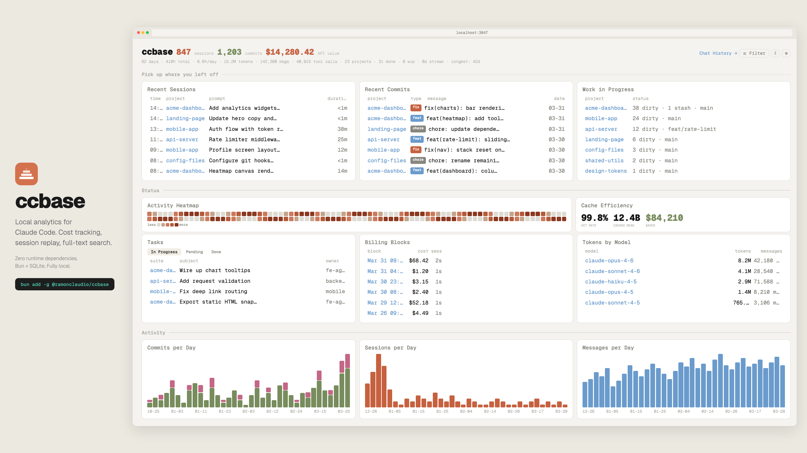

# ccbase

[](https://www.npmjs.com/package/@ramonclaudio/ccbase)
[](https://opensource.org/licenses/MIT)

I use Claude Code every day. Got curious how much value I'm actually getting out of the Max plan, so I started digging into `~/.claude/`. Turns out I'm saving a ton. That got me looking at the rest of the data: commits per day, cache hit rates, what sessions I'm working on, all of it.

Built a dashboard so I can see everything when I start my day. Where did I leave off, what's in progress, what tasks are open. Then I wanted my full chat history across projects because the CLI only shows sessions for the project you're in. So now there's a chat viewer with full-text search. Everything parses into SQLite and stays local.

I also kept hitting a problem where moving a project (like from a private dir to public after open-sourcing) breaks all session history. Can't resume, past conversations gone. Claude Code stores absolute paths and doesn't handle moves. So I built `ccbase mv` to fix that.



## Install

```bash
bun add -g @ramonclaudio/ccbase
```

Or clone and run from source:

```bash
git clone https://github.com/ramonclaudio/ccbase.git
cd ccbase
bun install
bun run ingest
bun start
```

Open [http://localhost:3847](http://localhost:3847). First run auto-ingests if no database exists.

## Commands

```bash
bun start                       # Dashboard + chat viewer on :3847
bun run dev                     # Same, with hot reload
bun run ingest                  # Parse ~/.claude/ into SQLite

ccbase log                      # Today's sessions by project
ccbase log --yesterday          # Yesterday
ccbase log --week               # This week
ccbase tasks                    # Open tasks across projects/teams
ccbase wip                      # Dirty repos, stashes, active sessions
ccbase progress                 # Commits and tasks shipped this week
ccbase search "query"           # Full-text search across conversations
ccbase sql "SELECT ..."         # Raw SQL (read-only)
ccbase export [path]            # Static HTML snapshot
ccbase ingest --force           # Drop and re-ingest from scratch

ccbase mv ~/old ~/new --dry-run # Preview path rewrites
ccbase mv ~/old ~/new           # Apply
```

## Move / Rename Projects

Claude Code stores absolute paths in `~/.claude/`. Move a project and those refs go stale, sessions break, `/resume` stops working. `ccbase mv` fixes all of it.

```bash
mv ~/Developer/private/my-app ~/Developer/public/my-app
ccbase mv ~/Developer/private/my-app ~/Developer/public/my-app --dry-run
ccbase mv ~/Developer/private/my-app ~/Developer/public/my-app
```

Rewrites paths in JSONL session files (including subagents), `sessions-index.json`, file history, paste cache, plans, backups, debug logs, `~/.claude.json`, and all database tables. Renames the dash-encoded project directory in `~/.claude/projects/`.

Replaces both `/Users/you/...` and `~/...` variants. Won't touch sibling projects (`app` won't match `app-v2`). Run `--dry-run` first.

## Configuration

Scans `~/Developer` for git repos by default. Override with `CCBASE_DEV_DIR`:

```bash
CCBASE_DEV_DIR=~/projects bun run ingest
```

Commits are filtered to your git identity via `git config user.name` and `user.email`. Dark/light mode defaults to OS preference.

## Privacy

Everything stays local. No network requests except `localhost`. Read-only against `~/.claude/` except `mv`, which rewrites path references after you move a project. Back up `~/.claude/` before running `mv`.

## License

MIT
