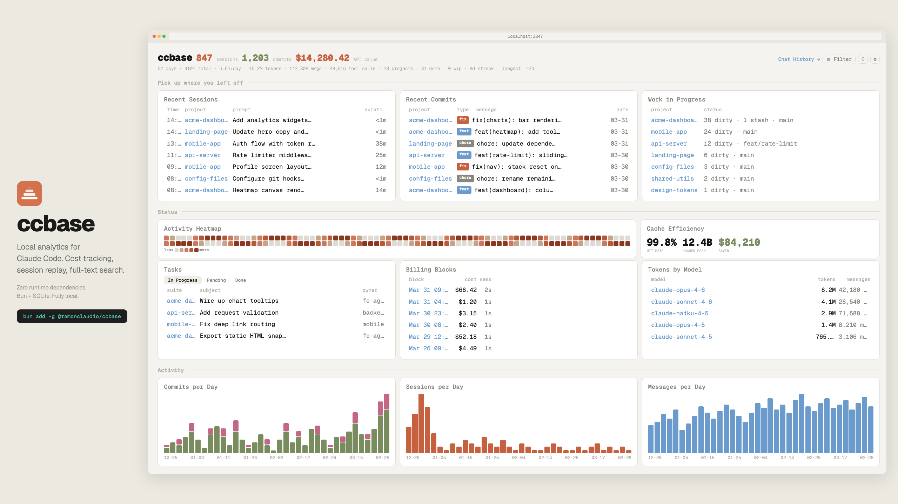

# ccbase

[](https://www.npmjs.com/package/@ramonclaudio/ccbase)
[](https://opensource.org/licenses/MIT)

I use Claude Code every day. Got curious how much value I'm actually getting out of the Max plan, so I started digging into `~/.claude/`. Turns out I'm saving a ton. That got me looking at the rest of the data: commits per day, cache hit rates, what sessions I'm working on, all of it.

Built a dashboard so I can see everything when I start my day. Where did I leave off, what's in progress, what tasks are open. Then I wanted my full chat history across projects because the CLI only shows sessions for the project you're in. So now there's a chat viewer with full-text search. Everything parses into SQLite and stays local.

I also kept hitting a problem where moving a project (like from a private dir to public after open-sourcing) breaks all session history. Can't resume, past conversations gone. Claude Code stores absolute paths and doesn't handle moves. So I built `ccbase mv` to fix that.



## Install

```bash
bun add -g @ramonclaudio/ccbase
```

Or clone and run from source:

```bash
git clone https://github.com/ramonclaudio/ccbase.git
cd ccbase
bun install
bun run ingest
bun start
```

Open [http://localhost:3847](http://localhost:3847). First run auto-ingests if no database exists.

## Commands

```bash
bun start                       # Dashboard + chat viewer on :3847
bun run dev                     # Same, with hot reload
bun run ingest                  # Parse ~/.claude/ into SQLite

ccbase log                      # Today's sessions by project
ccbase log --yesterday          # Yesterday
ccbase log --week               # This week
ccbase tasks                    # Open tasks across projects/teams
ccbase wip                      # Dirty repos, stashes, active sessions
ccbase progress                 # Commits and tasks shipped this week
ccbase search "query"           # Full-text search across conversations
ccbase sql "SELECT ..."         # Raw SQL (read-only)
ccbase export [path]            # Static HTML snapshot
ccbase ingest --force           # Drop and re-ingest from scratch

ccbase mv ~/old ~/new           # Preview path rewrites (dry-run by default)
ccbase mv ~/old ~/new --apply   # Commit

bun test                        # Fast fixture tests for the mv command
bun test:real                   # Real claude -p integration tests (~90s, ~$0.05)
```

## Move / Rename / Merge Projects

Claude Code stores absolute paths in `~/.claude/`. Move a project and those refs go stale, sessions break, `/resume` stops working. `ccbase mv` fixes all of it. Defaults to a dry-run, prints the full plan, and only writes when you pass `--apply`.

```bash
# Rename: move on disk, then update Claude state
mv ~/code/old-name ~/code/new-name
ccbase mv ~/code/old-name ~/code/new-name           # preview
ccbase mv ~/code/old-name ~/code/new-name --apply   # commit
```

Merge two projects' session histories into one (e.g. you renamed a repo on GitHub or rolled a `-monorepo` experiment back into the original dir):

```bash
trash ~/code/my-app
mv ~/code/my-app-monorepo ~/code/my-app
ccbase mv ~/code/my-app-monorepo ~/code/my-app --merge --apply
```

Merge N sources into one destination — last positional is the destination:

```bash
ccbase mv ~/code/a ~/code/b ~/code/c ~/code/final --merge --apply
```

Rewrites paths in JSONL session files (including subagents), `sessions-index.json`, file history, paste cache, plans, backups, debug logs, `history.jsonl`, `~/.claude.json`, `~/.claude.json.backup`, and all ccbase database tables. Renames or merges the dash-encoded project dir in `~/.claude/projects/` and the matching MCP log dir under `~/Library/Caches/claude-cli-nodejs/` (or `~/.cache/claude-cli-nodejs/` on Linux). Deep-merges `.claude.json` `projects[<path>]` entries when both sides exist (arrays union, objects merge with destination winning, scalars destination-wins). Also rewrites the destination project's own `.mcp.json`, `CLAUDE.md`, `CLAUDE.local.md`, and everything under `<project>/.claude/` (hooks, permissions, agents, commands, skills).

Before any writes, snapshots every affected dir + `~/.claude.json` + `history.jsonl` to `~/.claude/backups/ccbase-mv-<ts>.tar.gz`. Restore with `cd / && tar xzf <backup>`.

After a successful apply, archives each source's physical dir (if it still exists on disk) to `$CCBASE_BACKUP_DIR/<name>-<parent>-<timestamp>/`. Default backup dir is `<ccbase>/data/backups/`. Set `CCBASE_BACKUP_DIR=~/code-backups` (or wherever) to override. This keeps `ccbase ingest --force` from re-detecting stale projects from disk. Use `--no-archive` to keep them in place.

Replaces both `/Users/you/...` and `~/...` variants. Won't touch sibling projects (`app` won't match `app-v2`). Refuses by default when the destination encoded dir already exists, pass `--merge` to combine. Honors `CLAUDE_CONFIG_DIR` if you alias multiple accounts. Falls back to copy+remove when renaming across volumes.

Flags:

- `--apply` commit the changes (default is dry-run)
- `--merge` combine source sessions into an existing destination project
- `--no-project` skip rewriting files inside the destination project's own `.claude/`
- `--no-backup` skip the pre-apply snapshot tarball (not recommended)
- `--no-verify` skip the post-apply SHA + stale-ref + JSONL parse checks
- `--no-archive` skip moving source physical dirs to `$CCBASE_BACKUP_DIR`

## Configuration

Scans `~/Developer` for git repos by default. Override with `CCBASE_DEV_DIR`:

```bash
CCBASE_DEV_DIR=~/projects bun run ingest
```

`ccbase mv --apply` archives source physical dirs to `<ccbase>/data/backups/` by default. Override the location with `CCBASE_BACKUP_DIR`:

```bash
export CCBASE_BACKUP_DIR=~/code-backups
```

`ccbase mv` honors `CLAUDE_CONFIG_DIR` if you alias multiple Claude Code accounts.

Commits are filtered to your git identity via `git config user.name` and `user.email`. Dark/light mode defaults to OS preference.

## Privacy

Everything stays local. No network requests except `localhost`. Read-only against `~/.claude/` except `mv`, which rewrites path references after you move a project (and snapshots the affected files first).

## License

MIT
